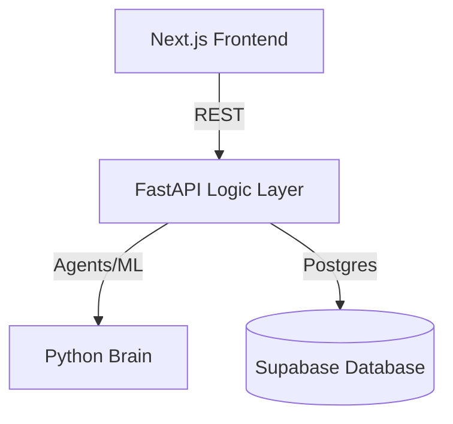

# Deriv Defensor

> **The Agentic Decisioning Platform for Partner Retention.**

Deriv Defensor is an AI-powered surveillance and intervention system designed to predict and prevent affiliate partner churn within the Deriv ecosystem. By combining high-fidelity Machine Learning (LightGBM/SHAP) with Generative AI (LLMs), Defensor doesn't just predict risk—it explains it and automates the solution.


## 🛡️ Key Features

- **Predictive Surveillance:** Real-time risk scoring using LightGBM and SHAP explainability.
- **GenAI Interventions:** Automated narrative analysis and email drafting for partner outreach.
- **Outcome Tracking:** Closed-loop monitoring of intervention ROI and protected Lifetime Value (LTV).
- **Agentic Automation:** One-click batch interventions triggered by intelligent risk thresholds.

## 🏗️ Modern Full-Stack Architecture

Deriv Defensor is built for scalability and performance:

- **Frontend:** Next.js 14 (App Router) with Tailwind CSS & Shadcn/UI.
- **Backend (Brain):** FastAPI (Python) hosting the ML models and Agent logic.
- **Data Layer:** Supabase (PostgreSQL) with Row-Level Security (RLS).
- **Explainability:** SHAP (SHapley Additive exPlanations) for model transparency.



## 🚀 Quick Start

### 1. Requirements
- Node.js 18+
- Python 3.10+
- Supabase Account

### 2. Setup
```bash
# Install Backend Dependencies
pip install -r requirements.txt

# Install Frontend Dependencies
cd web && npm install
```

### 3. Environment Variables
Create a `.env` in the root and `/web` directories:
- `SUPABASE_URL`
- `SUPABASE_KEY`
- `NEXT_PUBLIC_API_URL` (Points to http://localhost:8001)

### 4. Run Development
```bash
# Start Backend
./backend/run.sh

# Start Frontend
cd web && npm run dev
```

## 📈 Business Impact (Simulation)
Based on current synthetic validation:
- **LTV Protected:** $1.2M+
- **Intervention Success Rate:** ~74%
- **High-Risk Detection Precision:** 88%

---
*Built for the Deriv Advanced Agentic AI Challenge.*
