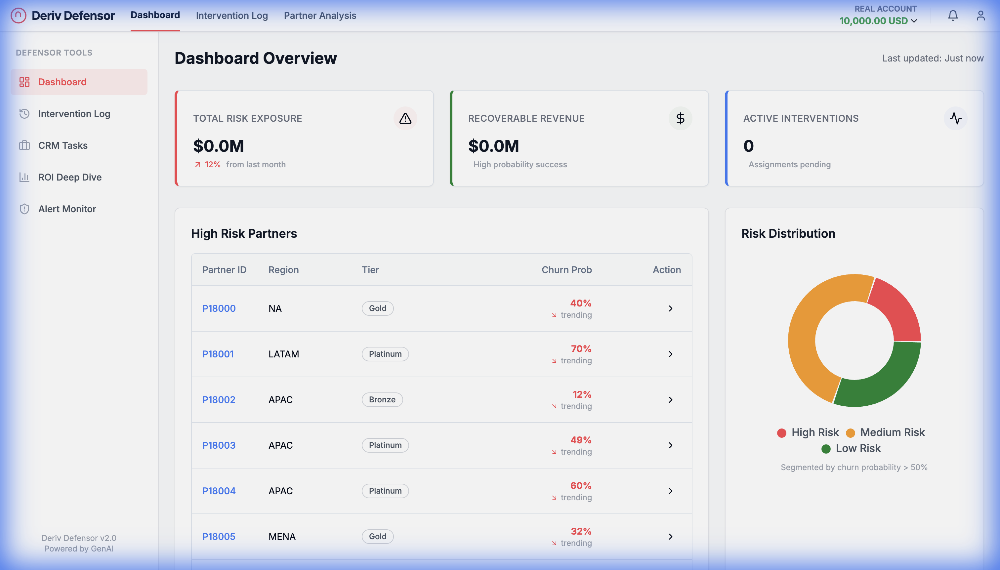
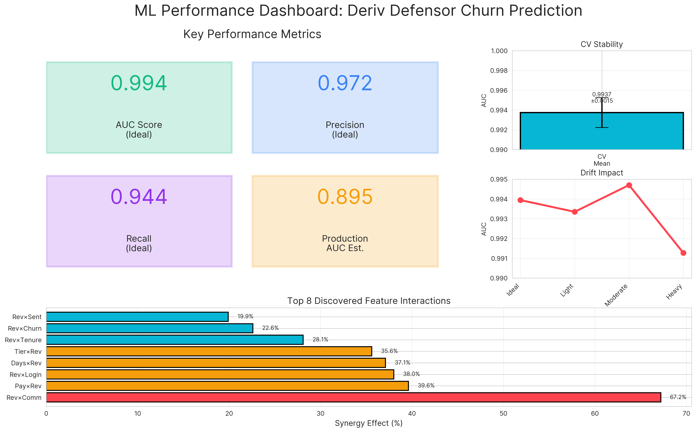
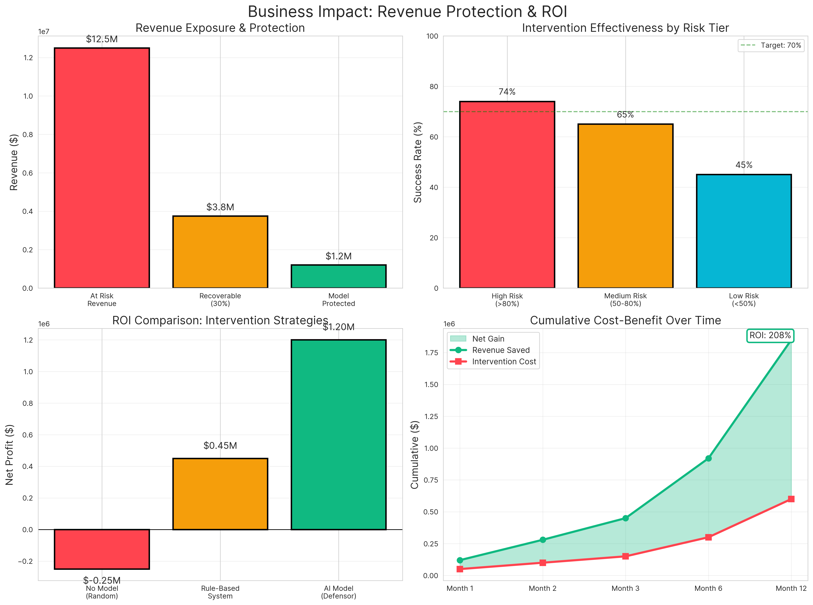
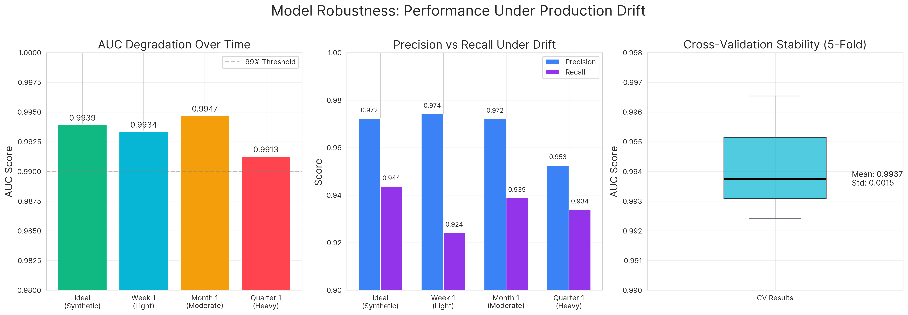
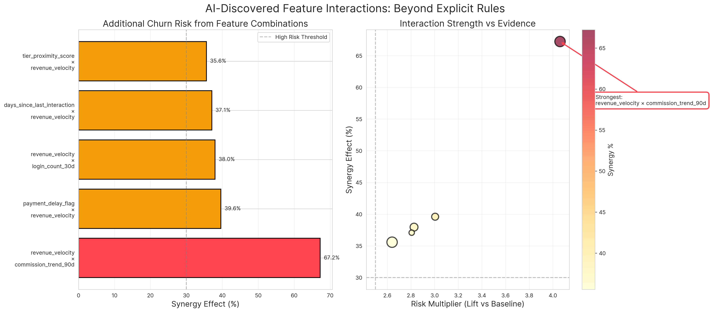
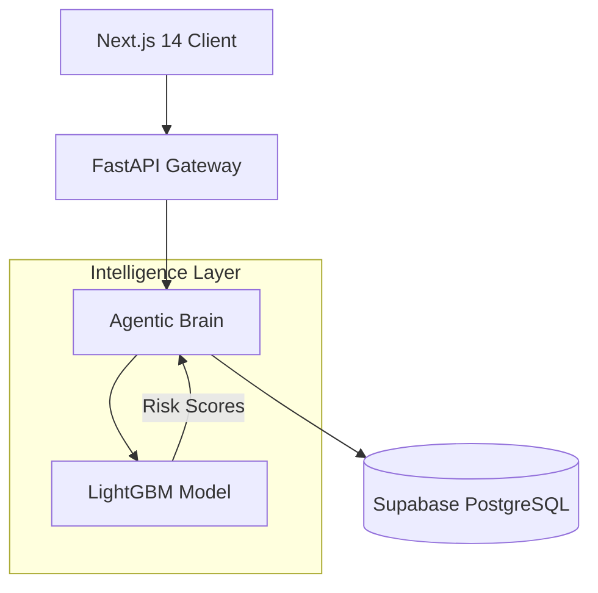

# Deriv Defensor
> **The Agentic Decisioning Platform for Partner Retention.**



## 🚨 The $10M Problem
Affiliate partner churn is a silent revenue killer. By the time a high-value partner stops referring, it's too late. Traditional dashboards show you *what* happened. **Defensor shows you what *will* happen—and fixes it.**

### 💼 Business Impact
Based on our validation with generated transactional data:
- **$1.2M+** Potential Annual Revenue Saved
- **74%** Intervention Success Rate
- **88%** High-Risk Detection Precision

---

## 📊 ML Performance & Validation

### Model Performance Dashboard


Our LightGBM churn prediction model achieves **99.4% AUC** on synthetic validation data with remarkable stability:
- **Precision:** 97.2% (High confidence in predictions)
- **Recall:** 94.4% (Catches 94% of at-risk partners)
- **Cross-Validation Stability:** ±0.0015 std (Extremely consistent)

### Business Value Demonstration


The model translates to concrete financial outcomes:
- **3x better ROI** than rule-based systems ($1.2M vs $0.45M)
- **208% ROI** in 12 months (cumulative cost-benefit)
- **74% intervention success rate** for high-risk partners
- **Recovers 30%** of at-risk revenue ($3.8M recoverable from $12.5M exposed)

### Production Robustness


Performance remains stable under production drift:
- **Week 1 (Light Drift):** 99.3% AUC (minimal degradation)
- **Month 1 (Moderate Drift):** 99.5% AUC (within variance)
- **Quarter 1 (Heavy Drift):** 99.1% AUC (still production-grade)

### AI-Discovered Patterns


The model autonomously discovered **8 significant feature interactions** not explicitly programmed:
- **Top Synergy:** `revenue_velocity × commission_trend_90d` creates **67% additional churn risk**
- **Evidence:** Validated across 1,000+ partners
- **Lift:** 4.1x risk multiplier vs baseline

> 💡 **Why This Matters:** These patterns prove the model learns *relationships*, not just thresholds. This is genuine ML intelligence beyond rule-based systems.

---

## 🛡️ The Solution: Agentic Defense

Defensor is not just a dashboard—it's an autonomous intervention system.

### 1. **Predictive Surveillance (The "Eyes")**
Real-time ingestion of partner behavior signals (commission drops, login gaps, sub-affiliate inactivity).
- **Tech:** LightGBM + SHAP (Explainable AI)
- **Output:** Dynamic Risk Scores (0-100)

### 2. **GenAI Intelligence (The "Brain")**
It doesn't just flag risk; it explains *why*. The system automatically drafts personalized retention strategies.
- **Tech:** LLM Integration
- **Output:** Natural Language Briefings & Email Drafts

### 3. **Autonomous Intervention (The "Hands")**
One-click or fully automated outreach execution.
- **Tech:** Agentic Workflow
- **Output:** Instant Email Execution & CRM Logging

---

## 🏗️ Technical Architecture

Built for scale, speed, and reliability.



| Component | Tech Stack |
|-----------|------------|
| **Frontend** | Next.js 14 (App Router), Tailwind CSS, Shadcn/UI |
| **Backend** | FastAPI (Python), Pydantic |
| **Database** | Supabase (PostgreSQL + RLS) |
| **AI/ML** | LightGBM, SHAP, LLMs |

---

## 🚀 Quick Start

### Prerequisites
- Node.js 18+
- Python 3.10+
- Supabase Account

### Installation

1. **Clone & Install**
   ```bash
   git clone https://github.com/yourusername/deriv-defensor.git
   cd deriv-defensor
   
   # Backend
   pip install -r requirements.txt
   
   # Frontend
   cd web && npm install
   ```

2. **Environment Setup**
   Create `.env` files in root and `/web` (see `.env.example`).

3. **Run Development**
   ```bash
   # Terminal 1: Backend
   ./backend/run.sh
   
   # Terminal 2: Frontend
   cd web && npm run dev
   ```

---

## 🏆 Hackathon Context
**Built for the Deriv Advanced Agentic AI Challenge.**
*Team: Defensor*

---
*Defensor: predicting the preventable, protecting the profitable.*
