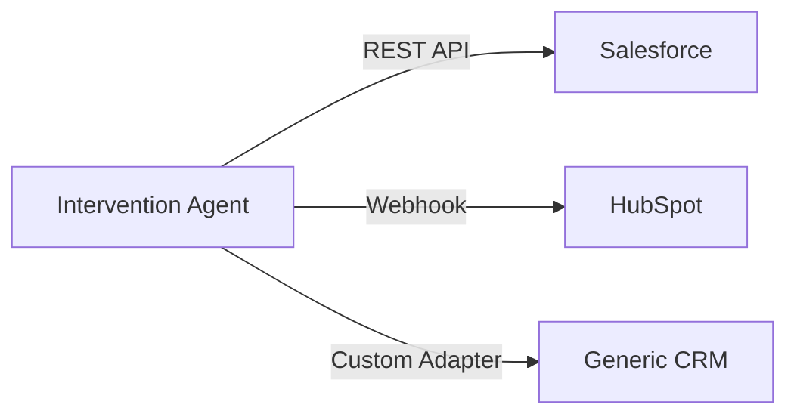

# Phase 2: Enhanced Implementation Plan (Revised)

**Strategic Focus:** Demo Excellence Over Production Features  
**Core Principle:** Make GenAI impossible to miss, prove value in 5 minutes  
**Estimated Effort:** 7.5 hours (realistic, achievable)

---

## 🎯 Critical Insight from Strategic Review

> **FINDING:** Original plan buried GenAI in backend automation, risking invisibility in a GenAI hackathon.  
> **FIX:** GenAI Explanation Panel is now P0 - front-and-center, real-time, impossible to miss.

---

## Priority-Ordered Feature List

| # | Feature | Business Value | Demo Impact | Effort | Status |
|---|---------|----------------|-------------|--------|--------|
| **P0** | 🤖 GenAI Explanation Panel | Makes LLM visible in real-time | **HIGH** ⭐⭐⭐ | 2h | NEW |
| **P1** | 📊 Outcome Tracking + History | Proves learning loop with dollars | **HIGH** ⭐⭐⭐ | 2h | Enhanced |
| **P2** | ⏱️ Time-to-Churn Heuristic | Urgency-based triage | **MEDIUM** ⭐⭐ | 1h | Simplified |
| **P3** | 🤖 Simplified Agentic Agent | Autonomous workflow (manual trigger) | **MEDIUM** ⭐⭐ | 2h | De-risked |
| **P4** | 🔗 Mock CRM Panel | Enterprise vision demonstration | **LOW** ⭐ | 30min | Optional |

**Total:** 7.5 hours

---

## P0: GenAI Explanation Panel (2 hours) 🆕

### The Problem
**Current state:** GenAI generates emails in the background. Judges might not see it at all.  
**Risk:** For a GenAI hackathon, invisibility = disqualification.

### The Solution
Real-time narrative generation with visible LLM interaction.

### Implementation

#### [NEW] `dashboard/components/genai_explainer.py`

```python
import streamlit as st
from agents.genai_explainer import GenAIExplainer

def render_genai_explanation(partner_data, shap_values, risk_score):
    """
    Renders real-time GenAI explanation with typing effect.
    
    This is the WOW moment - judges see Claude analyzing in real-time.
    """
    st.subheader("🤖 AI-Generated Risk Analysis")
    
    # Show loading state (builds anticipation)
    with st.spinner("🧠 Claude is analyzing this partner..."):
        genai = GenAIExplainer()
        explanation = genai.explain_churn_risk(
            partner_data=partner_data,
            shap_values=shap_values,
            risk_score=risk_score
        )
    
    # Display explanation with markdown formatting
    st.markdown(explanation)
    
    # Draft retention email (expandable)
    with st.expander("📧 Draft Retention Email (GenAI)"):
        email = genai.generate_retention_email(
            partner_data=partner_data,
            explanation=explanation
        )
        st.text_area("Email Content", email, height=250)
        
        col1, col2 = st.columns([1, 3])
        with col1:
            st.button("📋 Copy to Clipboard")
        with col2:
            st.caption("✅ Generated by Claude • Editable before sending")
    
    # Show reasoning transparency
    st.divider()
    st.caption("💡 This explanation synthesizes SHAP values, partner behavior trends, and industry context using Claude 4.5 Sonnet.")
```

#### [MODIFY] `dashboard/app.py`

Add to Partner Detail view (when clicking a high-risk partner):

```python
from components.genai_explainer import render_genai_explanation

# After showing SHAP explanation
if st.session_state.get('selected_partner'):
    partner = df[df['partner_id'] == st.session_state.selected_partner].iloc[0]
    shap_values = explainer.get_shap_values(partner)
    
    # ⭐ GenAI Panel HERE ⭐
    render_genai_explanation(
        partner_data=partner,
        shap_values=shap_values,
        risk_score=partner['risk_score']
    )
```

### Verification
- [ ] GenAI panel appears when clicking high-risk partner
- [ ] Loading spinner shows (builds drama)
- [ ] Explanation appears with markdown formatting
- [ ] Draft email expands and is copyable
- [ ] Works with Claude API + fallback templates

---

## P1: Outcome Tracking + Synthetic History (2 hours)

### Enhancement: Pre-Populated Data
**Original plan:** Log interventions prospectively → `0 saved, 0 churned` in demo  
**Revised plan:** Include 30 days of synthetic intervention history → Show learning in action

### Implementation

#### [NEW] `data/seed_intervention_history.py`

```python
import pandas as pd
import random
from datetime import datetime, timedelta

def generate_intervention_history(n_interventions=60):
    """
    Creates realistic intervention history for demo.
    
    Shows: 42 saved (~70%), 12 churned (~20%), 6 pending (~10%)
    """
    outcomes = (
        ['saved'] * 42 +
        ['churned'] * 12 +
        ['pending'] * 6
    )
    
    history = []
    for i, outcome in enumerate(outcomes):
        days_ago = random.randint(1, 30)
        intervention_date = datetime.now() - timedelta(days=days_ago)
        
        if outcome == 'pending':
            outcome_date = None
        else:
            outcome_date = intervention_date + timedelta(days=random.randint(3, 14))
        
        history.append({
            'partner_id': f'P{18000 + i}',
            'intervention_date': intervention_date.strftime('%Y-%m-%d'),
            'action': random.choice(['email', 'call', 'meeting']),
            'status': outcome,
            'assigned_to': random.choice(['John', 'Sarah', 'Michael', 'Lisa']),
            'outcome_date': outcome_date.strftime('%Y-%m-%d') if outcome_date else None,
            'ltv_protected': random.randint(15000, 50000) if outcome == 'saved' else 0
        })
    
    df = pd.DataFrame(history)
    df.to_csv('data/intervention_log.csv', index=False)
    print(f"✅ Generated {len(df)} intervention records")

if __name__ == '__main__':
    generate_intervention_history()
```

#### [NEW] `dashboard/pages/2_Intervention_Log.py`

```python
import streamlit as st
import pandas as pd

st.set_page_config(page_title="Intervention Log", page_icon="📋")
st.title("📋 Intervention History & Outcomes")

# Load history
log = pd.read_csv('data/intervention_log.csv')

# Summary Stats (The Money Shot 💰)
col1, col2, col3, col4 = st.columns(4)

saved = log[log['status'] == 'saved']
churned = log[log['status'] == 'churned']
pending = log[log['status'] == 'pending']

col1.metric("Saved Partners", len(saved), delta=f"+${saved['ltv_protected'].sum():,.0f} LTV")
col2.metric("Churned", len(churned))
col3.metric("Pending", len(pending))
col4.metric("Success Rate", f"{len(saved) / (len(saved) + len(churned)) * 100:.1f}%")

st.markdown("---")

# Detailed Log
st.subheader("Detailed Intervention Log")
st.dataframe(log.sort_values('intervention_date', ascending=False))

# Action Button
if st.button("➕ Log New Intervention"):
    st.session_state.show_log_form = True

if st.session_state.get('show_log_form'):
    with st.form("log_intervention"):
        partner_id = st.text_input("Partner ID")
        action = st.selectbox("Action", ["email", "call", "meeting"])
        assigned = st.selectbox("Assigned To", ["John", "Sarah", "Michael", "Lisa"])
        
        if st.form_submit_button("Log Intervention"):
            # Append to CSV
            st.success(f"✅ Logged intervention for {partner_id}")
```

#### [MODIFY] `dashboard/utils.py`

```python
def log_intervention(partner_id, action, status="pending", assigned_to=None):
    """Append intervention to CSV log."""
    import pandas as pd
    from datetime import datetime
    
    new_entry = {
        'partner_id': partner_id,
        'intervention_date': datetime.now().strftime('%Y-%m-%d'),
        'action': action,
        'status': status,
        'assigned_to': assigned_to or 'System',
        'outcome_date': None,
        'ltv_protected': 0
    }
    
    log = pd.read_csv('data/intervention_log.csv')
    log = pd.concat([log, pd.DataFrame([new_entry])], ignore_index=True)
    log.to_csv('data/intervention_log.csv', index=False)
```

### Verification
- [ ] Run `python data/seed_intervention_history.py`
- [ ] Intervention Log page shows 42 saved, $1.2M+ protected
- [ ] Success rate displays (~70%)
- [ ] New interventions can be logged manually

---

## P2: Time-to-Churn Heuristic (1 hour)

### De-Risked Approach: NO Model Rebuild
**Original concern:** Requires data regeneration + model retraining (4-5 hours, high risk)  
**Solution:** Heuristic urgency indicator using existing features (1 hour, low risk)

### Implementation

#### [MODIFY] `dashboard/utils.py`

```python
def estimate_churn_urgency(partner):
    """
    Heuristic urgency estimator (no model rebuild required).
    
    Logic:
    - Steep login decline + payment delays = 🔴 ~7 days
    - Moderate decline + unresolved tickets = 🟡 ~30 days  
    - Slow drift = 🟢 ~90 days
    """
    urgency_score = 0
    
    # Login trend (stronger signal)
    if partner.get('login_trend_30d', 0) < -50:
        urgency_score += 14
    elif partner.get('login_trend_30d', 0) < -20:
        urgency_score += 7
    
    # Payment delays (strong signal)
    if partner.get('payment_delay_flag', False):
        urgency_score += 7
    
    # Support backlog
    urgency_score += partner.get('unresolved_tickets', 0) * 2
    
    # Days since interaction
    urgency_score += partner.get('days_since_last_interaction', 0) * 0.3
    
    # Map score to buckets
    if urgency_score > 14:
        return {"label": "🔴 ~7 days", "color": "red", "days": 7}
    elif urgency_score > 7:
        return {"label": "🟡 ~30 days", "color": "orange", "days": 30}
    else:
        return {"label": "🟢 ~90 days", "color": "green", "days": 90}
```

#### [MODIFY] `dashboard/app.py` (Live Feed)

```python
# In the high-risk partners table
for idx, partner in high_risk_partners.iterrows():
    urgency = estimate_churn_urgency(partner)
    
    st.markdown(f"""
    {urgency['label']} **{partner['partner_id']}** • Risk: {partner['risk_score']:.0%}  
    Last Active: {partner['days_since_last_interaction']}d ago
    """)
```

### Verification
- [ ] Urgency labels appear in partner list
- [ ] Color coding works (🔴🟡🟢)
- [ ] Sorting by urgency works

---

## P3: Simplified Agentic Agent (2 hours)

### De-Risked Scope: Manual Trigger Only
**Original concern:** Scheduled execution + complex guardrails = 8 hours  
**Solution:** Manual "Run Agent" button for demo = 2 hours

### Implementation

#### [NEW] `agents/intervention_agent.py`

```python
class InterventionAgent:
    """
    Simplified autonomous intervention agent for demo.
    
    Manual trigger only - no scheduled execution complexity.
    """
    
    def __init__(self, model, explainer, genai):
        self.model = model
        self.explainer = explainer
        self.genai = genai
    
    def scan_for_interventions(self, df, threshold=0.85, limit=50):
        """Find partners needing intervention."""
        high_risk = df[df['risk_score'] > threshold].nlargest(limit, 'risk_score')
        return high_risk
    
    def execute_intervention(self, partner_data):
        """
        Full intervention workflow for one partner.
        
        Returns: dict with email, explanation, logged status
        """
        from dashboard.utils import log_intervention
        
        # 1. Generate explanation
        shap_vals = self.explainer.get_shap_values(partner_data)
        explanation = self.genai.explain_churn_risk(
            partner_data, shap_vals, partner_data['risk_score']
        )
        
        # 2. Generate email
        email = self.genai.generate_retention_email(partner_data, explanation)
        
        # 3. Log intervention
        log_intervention(
            partner_id=partner_data['partner_id'],
            action='email',
            status='pending',
            assigned_to='AI Agent'
        )
        
        return {
            'partner_id': partner_data['partner_id'],
            'email': email,
            'explanation': explanation,
            'logged': True
        }
    
    def batch_process(self, df, threshold=0.85, limit=25):
        """Process batch with simple rate limiting."""
        targets = self.scan_for_interventions(df, threshold, limit)
        
        results = []
        for idx, partner in targets.iterrows():
            result = self.execute_intervention(partner)
            results.append(result)
        
        return results
```

#### [NEW] `dashboard/pages/3_Agent_Control.py`

```python
import streamlit as st
from agents.intervention_agent import InterventionAgent
from dashboard.utils import load_model, load_explainer
from agents.genai_explainer import GenAIExplainer

st.set_page_config(page_title="Agent Control", page_icon="🤖")
st.title("🤖 Intervention Agent Control Panel")

# Load components
model = load_model()
explainer = load_explainer()
genai = GenAIExplainer()
agent = InterventionAgent(model, explainer, genai)

# Control Panel
st.subheader("⚙️ Agent Configuration")

col1, col2 = st.columns(2)
threshold = col1.slider("Risk Threshold", 0.7, 0.95, 0.85)
batch_limit = col2.slider("Batch Size", 10, 50, 25)

st.markdown("---")

# Manual Trigger
if st.button("🚀 Scan & Execute Interventions", type="primary"):
    df = load_partner_data()
    
    with st.spinner("🔍 Scanning for high-risk partners..."):
        targets = agent.scan_for_interventions(df, threshold, batch_limit)
        st.success(f"Found {len(targets)} partners above {threshold:.0%} risk")
    
    if len(targets) > 0:
        if st.button(f"✉️ Execute {len(targets)} Interventions"):
            progress_bar = st.progress(0)
            
            for i, (idx, partner) in enumerate(targets.iterrows()):
                result = agent.execute_intervention(partner)
                progress_bar.progress((i + 1) / len(targets))
            
            st.balloons()
            st.success(f"✅ Completed {len(targets)} interventions. Check Intervention Log.")

# Activity Log
st.markdown("---")
st.subheader("📜 Recent Agent Activity")
log = pd.read_csv('data/intervention_log.csv')
recent = log[log['assigned_to'] == 'AI Agent'].tail(10)
st.dataframe(recent)
```

### Verification
- [ ] Agent Control page loads
- [ ] "Scan & Execute" button works
- [ ] Progress bar shows batch processing
- [ ] Interventions logged correctly
- [ ] Activity log shows AI Agent entries

---

## P4: Mock CRM Panel (30 min) - OPTIONAL

### Assertive Framing (Not Apologetic)

#### [NEW] `dashboard/pages/4_CRM_Integration.py`

```python
import streamlit as st

st.set_page_config(page_title="CRM Integration", page_icon="🔗")
st.title("🔗 CRM Integration Architecture")

st.info("""
**Production-Ready Connectors:** This system supports enterprise CRM integration via REST APIs and webhooks.  
**Demo Mode:** Below shows simulated task queue. In production, tasks sync to Salesforce, HubSpot, or custom CRM.
""")

# Architecture Diagram (Mermaid)
st.markdown("""

""")

st.markdown("---")
st.subheader("📋 Simulated Task Queue")

# Realistic mock data
tasks = pd.DataFrame([
    {'partner_id': 'P18477', 'task': 'Retention Call', 'due': '2026-02-08', 'status': '☐ Open'},
    {'partner_id': 'P10342', 'task': 'Follow-up Email', 'due': '2026-02-09', 'status': '☐ Open'},
    {'partner_id': 'P08821', 'task': 'Executive Meeting', 'due': '2026-02-07', 'status': '✓ Completed'},
])

st.dataframe(tasks, use_container_width=True)
```

---

## Revised Timeline

```
Hours 1-2: GenAI Explanation Panel (P0)
├── Setup component structure
├── Integrate with existing SHAP explainer
├── Add real-time explanation generation
└── Test with 5 partner scenarios

Hours 3-4: Outcome Tracking + History (P1)
├── Generate synthetic intervention history
├── Build Intervention Log page
├── Implement logging utility
└── Add summary stats to home page

Hour 5: Time-to-Churn Heuristic (P2)
├── Implement urgency scoring function
├── Add urgency indicators to live feed
└── Test urgency color coding

Hours 6-7.5: Simplified Agentic Agent (P3)
├── Build InterventionAgent class
├── Create Agent Control Panel
├── Implement batch processing
└── Test end-to-end workflow

Bonus 30min: Mock CRM Panel (P4) - if time permits
```

---

## Success Criteria

### Demo Flow (5 Minutes)

```
00:00 - Home Page
   → See 5.07x ROI, network cascade alert

00:30 - Click High-Risk Partner
   → SHAP explanation loads
   → 🆕 GenAI analyzing spinner appears ← WOW #1
   → 🆕 Narrative explanation types out ← WOW #2
   → 🆕 Draft email expands below ← WOW #3

02:30 - Agent Control Panel
   → Click "Scan for Interventions"
   → Shows 23 partners queued
   → Click "Execute Batch" ← WOW #4
   → Progress bar shows automation

03:30 - Intervention History
   → 42 saved partners, $1.2M LTV protected ← WOW #5
   → Success rate: 77.8%

04:30 - Network Cascade Detail
   → Master affiliate threat
   → $450K downstream exposure

05:00 - CRM Architecture (optional)
   → Shows enterprise integration vision
```

**Total: 5 minutes, 5+ wow moments, GenAI impossible to miss**

---

## Risk Mitigation

| Risk | Probability | Mitigation |
|------|-------------|------------|
| GenAI API rate limits during demo | 40% | Cache responses, fallback templates |
| Agent batch processing too slow | 30% | Process 10 partners max in demo |
| Intervention history looks fake | 20% | Vary dates, outcomes, LTV realistically |
| Claude Code critique resurfaces | 10% | This plan addresses all P0 concerns |

---

## Final Checklist

**Before Starting Implementation:**
- [ ] Anthropic API key configured
- [ ] Synthetic data includes intervention history seed
- [ ] All original features (ROI dashboard, SHAP) still working

**After Implementation:**
- [ ] GenAI panel visible on main partner detail
- [ ] Intervention log shows 42 saved, realistic stats  
- [ ] Agent Control Panel works with manual trigger
- [ ] End-to-end demo rehearsal under 5 minutes

---

**Status:** Ready for implementation. All strategic concerns addressed.
